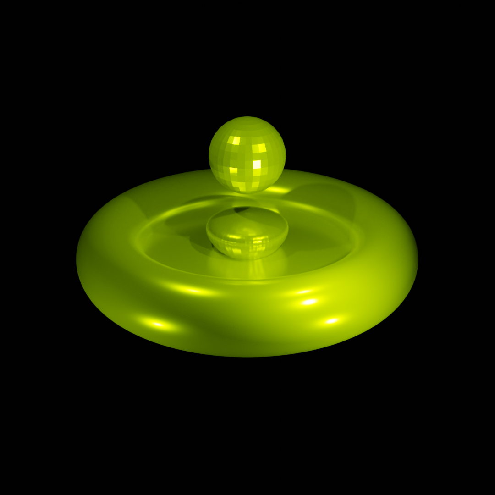
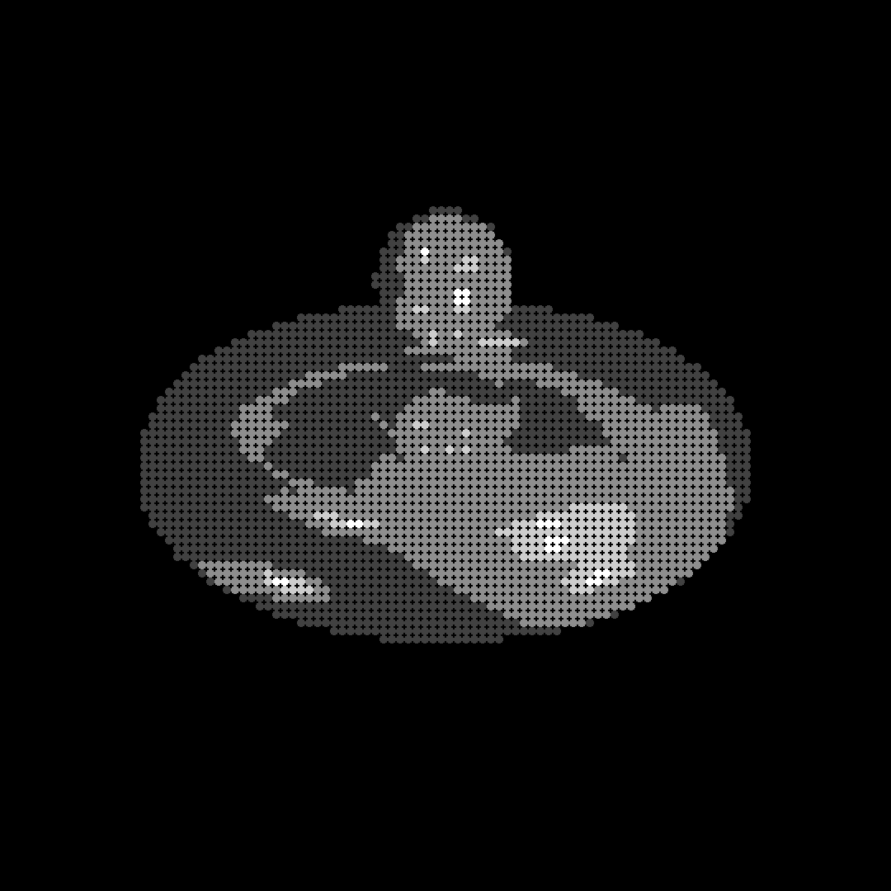

# Image-Texture

This Python script creates a mosaic version of an input image by replacing each pixel (after resizing) with a texture block that best matches its color. It uses OpenCV for image processing and NumPy for efficient calculations.

## 🖼️ Example

| Original Image | Mosaic Output |
|----------------|----------------|
|  |  |
---

## How It Works

1. The original image is resized to a low-resolution version where each "pixel" represents a block.
2. Each block is matched with the closest texture from a folder of small images based on average RGB color.
3. A new image is built by stitching together the selected textures.

---
## Getting Started

### 1. Install Requirements

This script requires Python 3 and the following libraries:

```bash
pip install numpy opencv-python
```
### 2. Set paths
  Set the paths to your input image, and the textures folder. You can find some examples in the images and textures folders.
```python
originImage = cv.imread("PATH_TO_YOUR_IMAGE")
folder_path = "PATH_TO_THE_TEXTURE_FOLDER"
```
### 3. Run 
```bash
  python index2.py
```
## Output 
  The script will:
  * Show the final mosaic in a window
  * Save it as output_image.png
